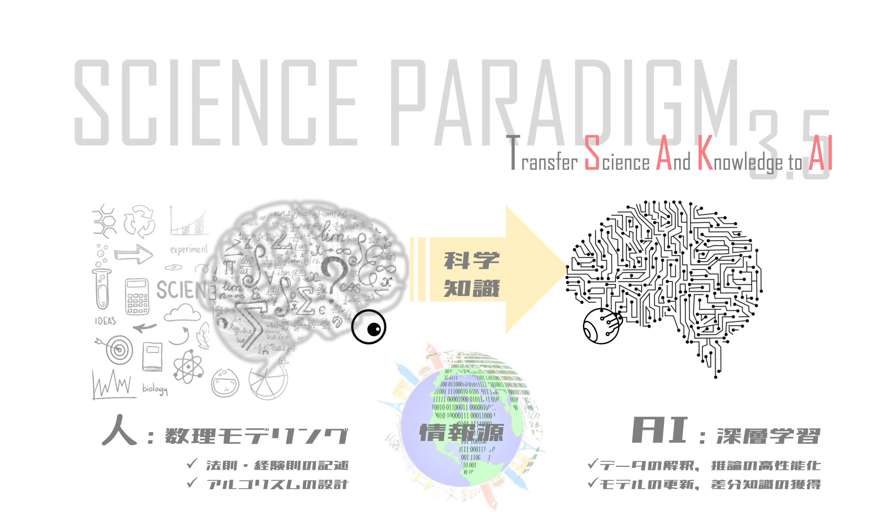
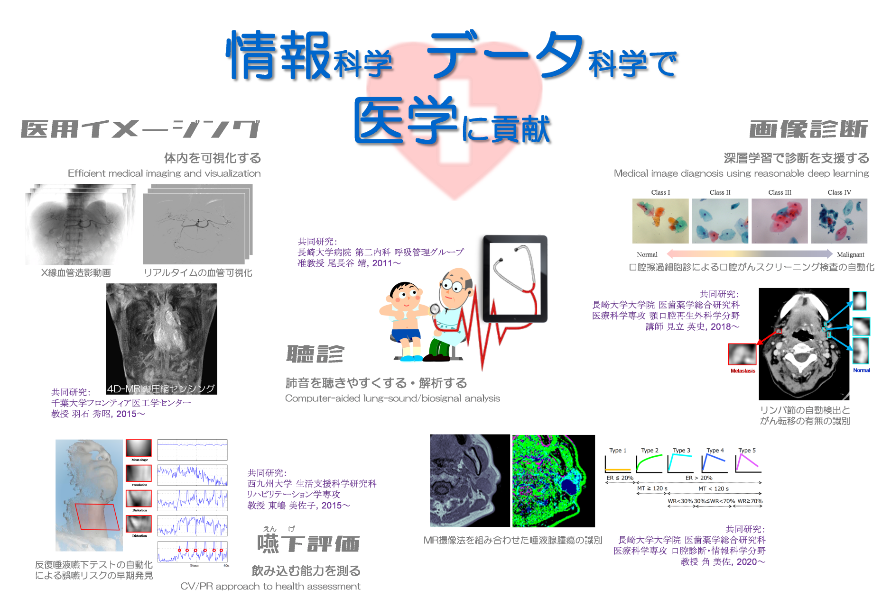

情報科学・データ科学が生み出す情報技術の本質は，考える仕組みそのものです． 
データは，どのようにして生まれ，その数値や記号の組合せが何を表しているのか？ 
これまでの知識をデータの理解に活かせないか？ 
科学と知識を記述する数理モデリング．データから情報を抽出する機械学習．両者の融合が問題解決の鍵になる． 
ここ長崎大学でも学び究める機会があることを，志のある人は見逃さないでほしいです．

## 目次
{: .no_toc .text-delta }

1. TOC
{: toc}

## 数理モデルからの知識の転移と学習

データしか使わないなんて，もったいない．

数学の言葉で書かれた科学と知識．これを人工知能に授ければ， 
人の知識を補う情報を上手に獲得できるでしょう．

外部リンク：
- [Science Paradigm 3.5：数理モデリングとディープラーニングの融合（長崎大学情報データ科学部 第8回コロキウム，2021）](https://youtu.be/rjoyNXX2NK8){:target="_blank"}
- [数理モデルからの知識の転移と学習およびその医工学応用（基盤研究(B)，研究代表者，2019-2022）](https://kaken.nii.ac.jp/ja/grant/KAKENHI-PROJECT-19H04177/){:target="_blank"}

 

## 共同研究　ー 情報科学・データ科学で医学に貢献 －

特に医学への応用では，正確なだけでなく**説得力**のある情報が求められます． 
そんなとき，医学の知識を下地にしたデータ科学が不可欠です．

外部リンク：
- [MRIと深層学習を用いた口腔癌リンパ節転移予測法の確立（基盤研究(C)，2022-2024）](https://kaken.nii.ac.jp/ja/grant/KAKENHI-PROJECT-22K10150/){:target="_blank"}
- [ゲーム依存の社会浸透を防げるか？統合的科学評価と早期依存対策に向けた基盤研究（基盤研究(A)，2021-2024）](https://kaken.nii.ac.jp/ja/grant/KAKENHI-PROJECT-21H04853/){:target="_blank"}
- [高齢者支援の今後を見据えた嚥下波形の自動分類化に向けた基礎的研究（基盤研究(C)，2021-2024）](https://kaken.nii.ac.jp/ja/grant/KAKENHI-PROJECT-21K12773/){:target="_blank"}
- [人工知能を用いた口腔がんの細胞診・予後判定システムの開発（基盤研究(C)，2020-2022）](https://kaken.nii.ac.jp/ja/grant/KAKENHI-PROJECT-20K10163/){:target="_blank"}

 

## スパースモデリング　ー データの本質を見抜く新常識 －

外部リンク：
- [一のデータから十を知る（長崎大学広報誌Choho, 工学部創立50周年記念特別版，p.8）](http://www.eng.nagasaki-u.ac.jp/data/choho_50th.pdf#page=8){:target="_blank"}
- [スパースモデリングって何？（酒井講演資料）](https://sites.google.com/site/tsakailab/lecture){:target="_blank"}
- [圧縮センシングの基礎原理と画像再構成アルゴリズムの進歩（MEDICAL IMAGING TECHNOLOGY 34(4):177-185, 2016）](https://doi.org/10.11409/mit.34.177){:target="_blank"}
- [圧縮センシングに基づく超高次元非線形写像の機械学習に関する研究（新学術領域研究，2014-2015）](https://kaken.nii.ac.jp/ja/grant/KAKENHI-PUBLICLY-26120526/){:target="_blank"}
- [組合せ最適化問題としてのパターン認識：理論構築と実用化に関する研究（基盤研究(C)，2013-1015）](https://kaken.nii.ac.jp/ja/grant/KAKENHI-PROJECT-25330200/){:target="_blank"}
- [圧縮センシングの手法によるパターン認識の効率化、頑健化および秘匿化に関する研究（若手研究(B)，2010-2012）](https://kaken.nii.ac.jp/ja/grant/KAKENHI-PROJECT-22700163/){:target="_blank"}

その他：
- [スパースモデリングの深化と高次元データ駆動科学の創成，文科省科研費「新学術領域研究」](http://sparse-modeling.jp/about/){:target="_blank"}
- [情報科学の名探偵！魔法の数式 スパースモデリング，サイエンスZERO，No.514](https://www.google.co.jp/search?safe=off&biw=1089&bih=935&ei=VIwBWpnuLISW8gXokKrgDA&q=%E6%83%85%E5%A0%B1%E7%A7%91%E5%AD%A6%E3%81%AE%E5%90%8D%E6%8E%A2%E5%81%B5%EF%BC%81%E9%AD%94%E6%B3%95%E3%81%AE%E6%95%B0%E5%BC%8F+%E3%82%B9%E3%83%91%E3%83%BC%E3%82%B9%E3%83%A2%E3%83%87%E3%83%AA%E3%83%B3%E3%82%B0+%E3%82%B5%E3%82%A4%E3%82%A8%E3%83%B3%E3%82%B9ZERO+No.514&oq=%E6%83%85%E5%A0%B1%E7%A7%91%E5%AD%A6%E3%81%AE%E5%90%8D%E6%8E%A2%E5%81%B5%EF%BC%81%E9%AD%94%E6%B3%95%E3%81%AE%E6%95%B0%E5%BC%8F+%E3%82%B9%E3%83%91%E3%83%BC%E3%82%B9%E3%83%A2%E3%83%87%E3%83%AA%E3%83%B3%E3%82%B0+%E3%82%B5%E3%82%A4%E3%82%A8%E3%83%B3%E3%82%B9ZERO+No.514&gs_l=psy-ab.12..35i39k1.13784.16996.0.22392.4.4.0.0.0.0.104.387.3j1.4.0....0...1.1.64.psy-ab..0.2.199....0.Yx6lF_k00Fk){:target="_blank"}

 

## 研究室の理念

酒井研究室は，コンピュータ（計算機）ならではの「知恵」に関する研究をしてきました．私たちが研究しているパターン認識は，コンピュータが上手にデータを「みる」「きく」ことで「わかる」を実現する仕組みです．世の中には，画像認識，音声認識，動作認識等，様々なパターン認識の技術があります．しかし，それらのうち特定の技術に興味があるというよりも，パターンとは何なのかという原点に立ち返り，コンピュータだからこそ「みる」「きく」「わかる」ことができる能力を引き出すことに興味を持っています．

人間は上手に「みる」「きく」「わかる」ことができますが，だからと言って人間の経験則や感性・腕前だけでプログラミングしても工学にはなりません．なぜならば，コンピュータ（計算機）にできることはその名のとおり広い意味での「計算」なので，計算して解ける数学の問題にパターン認識を翻訳することが本質だからです．工学とは，先端技術を組み合わせて「所望のとおり動けば成功」という道具を開発するだけにとどまらず，「なぜ成功・失敗したのか」，「どんな条件で，どこまで性能を期待できるのか」を究明し，安全で有益な応用範囲を開拓するための学問であると思います．情報科学では更に，コンピュータにとって何が得意で何が不得意か，そしてコンピュータはどのように人を幸・不幸にする存在なのかを探究できればとも思います．

情報はデータがもつ特徴の組合せによって表されています．コンピュータの「みる」「きく」能力を十分に活かすためには，情報の収集・整理・分析・加工・提示といった一連の工程を考慮しながら，情報とデータを扱う科学技術を柔軟に選択し提供することが重要となるでしょう．そのような科学技術の要素は，信号処理やパターン認識，機械学習等の分野で培われてきました．それゆえ，これらの分野の横断的な研究課題に取り組むことを重視しています．例えば，なるべく多くの情報を獲得するためにデータ取得の方法や計測を見直すなど，情報処理のフロントエンドにある信号処理，専門知識や経験則を記述する数理モデリングおよびデータ同化，バックエンドにある機械学習をあわせて研究すれば，本質的な情報科学とデータ科学のかたちが見えてくるのではないかと考えています．

その一方で，残念なことに近年の人工知能の発展と普及の弊害として，これまで人類が培ってきた科学の知識を疎かにし，自称データサイエンティストがニューラルネットの部品を独自に組み合わせて深層学習させただけの工芸品や，その2次・3次創作品が流通するようにもなりました．データがもつ特徴の組合せで情報がどのように表現されているのかを考えるよりも，汎化性能の評価値を高くする数値遊びに一喜一憂するようでは，サイエンス（科学）とは呼べません．データサイエンスは科学の第4パラダイムとも称されますが，それが科学的方法として確立するためには，第3パラダイムまでの科学との橋渡しとなる基礎研究が非常に重要であると酒井は考えています．もしこのような見解に基づく研究に協賛していただけるならば幸いです．
